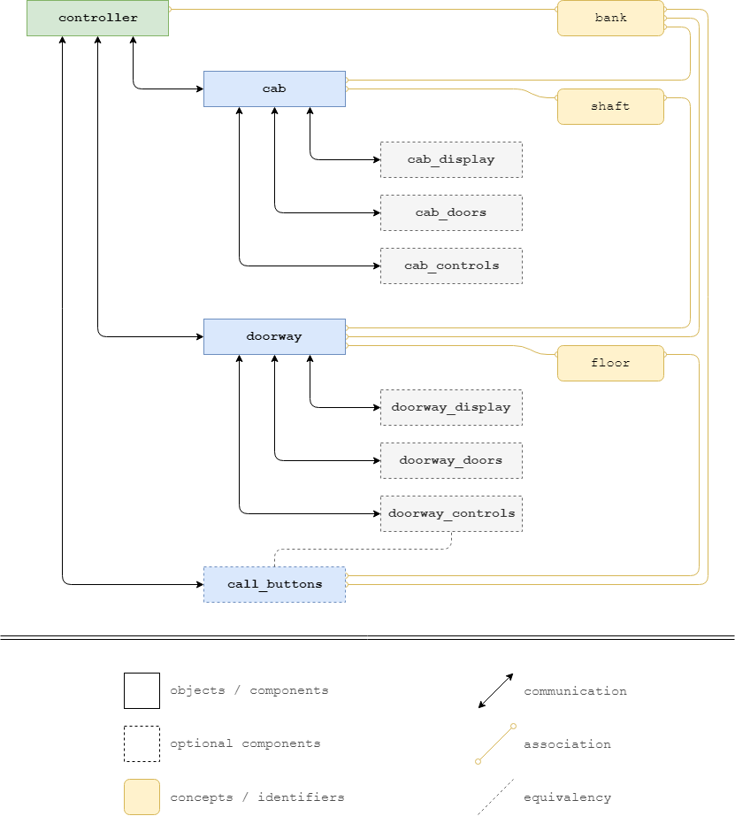

# Falcon Elevator

This is an attempt to create a set of open source LSL scripts for 
the operation of elevator systems in Second Life.

Currently, the [Delta Elevator](https://marketplace.secondlife.com/p/delta-elevator/15062326) 
is the most sophisticated elevator system in Second Life - by far. 
However, its scripts are closed source. This means using the Delta 
will introduce _no-mod_ scripts to a build, which can be an issue.

The Falcon will focus on core features. It does not aim to copy the 
full feature-set of the Delta. Also, with the target audience being 
creators, there won't be much effort on making the setup process 
particularly user-friendly.

The goal is to have a solid and versatile script that enables creators 
to come up with custom tailored elevator systems for their own builds 
or for distribution to end-users.

This is a very early work-in-progress. There isn't much to see here yet.

# Concept

The following are notes on how the system is intended to work; these are 
my personal implementation notes/concepts. Unless you are working on an 
elevator script yourself and want some inspiration, this won't be of use 
to you.

## Identifiers

Identifiers represent the relevant concepts of an elevator system:

- `bank`,  a set of elevators that work in conjunction
- `shaft`, conceptually equivalent to an elevator cab
- `floor`, a landing that a cab can travel to

## Components

The following components are required for operation:

| name              | number                  | associated with        |
|-------------------|-------------------------|------------------------|
| `controller`      | 1 per system            | `bank`                 |
| `cab`             | 1-4 per `bank`          | `bank`                 |
| `doorway`         | 1 per `shaft` & `floor` | `bank`, `shaft`, `floor` |
| `call_buttons`    | 0-4 per `floor`         | `bank`, `floor`        |

Note that the `call_buttons` may be implemented as subcomponent of a
`doorway` instead, hence why they are listed as optional above.

The `doorway` could, in the simplest case, be an invisible prim or piece 
of the floor in front of the cab entrance. Its main purpose is to 
determine the position of the `floor` landings, i.e. where the `cab`s 
are supposed to travel to exactly when they are being called to a 
specific `floor`.

## Subcomponents

The following components are optional and should come as a linked prim 
of a specific main component:

| name              | number                  | parent component       |
|-------------------|-------------------------|------------------------|
| `cab_controls`    | 0-1 per `cab`           | `cab`                  |
| `cab_display`     | 0-n per `cab`           | `cab`                  |
| `cab_doors`       | 0-n per `cab`           | `cab`                  |
| `doorway_display` | 0-n per `doorway`       | `doorway`              |
| `doorway_doors`   | 0-n per `doorway`       | `doorway`              |
| `call_buttons`    | 0-1 per `doorway`       | `doorway`              |

The handling of subcomponents is not set in stone. For some systems, it 
can make more sense to have individual scripts take care of these 
subcomponents. In other systems, it might be sufficient to have a single 
script in the parent component take care of the subcomponents.

I'm hoping to be able to eventually get two reference implementations 
out there; one for each of these cases. For now, one will have to do.

## Component diagram

## General thoughts

- All communcation between the main components always goes through the 
  controller; this means that even a system with only one cab needs to 
  have a controller
- The controller only knows the main components, it does not care 
  about the subcomponents (separation of concerns)
- Call buttons can be main components or subcomponents of doorways, 
  because we want the option to have a single call button for a set 
  (bank) of elevators, but we also want the option to simplify the 
  system by letting the doorways deal with the buttons

## Logic flow

### General initialization

#### Initialization and Pairing

1.  **Parse description**  
    On rez, all components read their description and parse `bank` name, 
    `shaft` name and `floor` name, if applicable
2.  **Setup listener**  
    The `controller` and all components of type `cab`, `doorway` and 
    `call_buttons` set up a listener on the same channel
3.  **Request pairing**  
    On touch, the `controller` broadcasts a `pair` message on said 
    channel; the message contains at least the `bank` name
4.  **Confirm pairing**  
    All listening components check if the `bank` name matches their own; 
    if so, they message the `controller` back with a `status` message, 
    specifying their `shaft` and `floor` name, if applicable
5.  **Remember components**  
    The `controller` creates and maintains a list of all components that 
    reported back
6.  **Sanity check** _optional_  
    The `controller` checks if all required components are in place; 
    that is, at least one `cab` and at least two `doorway` objects for 
    each `cab`; `call_buttons` are seen as optional as they might be 
    implemented as a subcomponent of the `doorway` objects
7.  **Read config**  _optional_  
    The `controller` reads its configuration notecard and parses all 
    relevant information; amongst that information can optionally be a 
    list of floor numbers/names (one to two digits)

#### Setup
    
1.  **Find base doorway**  
    The `controller` queries the location and rotation of the _base_ 
    `doorway` (the one closests in z-position to the associated `cab`)
2.  **Request doorway setup**  
    The `controller` sends a message to all `doorway`s, instructing them 
    to perform setup; this message includes the x- and y-position and 
    rotation as queried from the _base_ doorway, as well as their custom 
    floor number/name, if any; additionally, it includes a list of all 
    `floor`s and their accessibility (this is important so that the 
    `doorway`s can setup linked `call_buttons` correctly, if any)
3.  **Peform doorway setup**  
    All `doorway`s undergo setup and report failure or success back to 
    the `controller`
4.  **Request cab setup**  
    The `controller` sends a message to all `cab`s, instructing them to 
    perform setup; this message includes a list of all `floor`s, 
    including their z-position, as well as their custom floor names, 
    if any, and whether each `floor` is actually accessible by that 
    particular `cab` (some floors might not be accessible by all the 
    `cab`s in a `bank`)
5.  **Perform cab setup**  
    All `cab`s perform setup, including setting up their subcomponents; 
    the `cab`s then send a message back to the `controller`, 
    specifying if setup was successfull or failed
6.  **Request button setup**  
    The `controller` sends a message to all `call_buttons` (if any), 
    instructing them to perform setup; the message contains a list of 
    all `floor`s and their accessibility (this is important so that the 
    buttons can be set up correctly, i.e. show only an up-arrow button 
    if there are no floors below etc)
7.  **Perform button setup**  
    All `call_buttons`, if any, perform setup and report back to the 
    `controller` accordingly
8.  **Inform about success**  
    If all components were setup successfully, the `controller` sends 
    out messages to all registered components, informing them that the 
    system is ready
9.  **Finish up**  
    All components may now peform additional steps to get into their 
    individual idle/ready states; for example, all `cab`s and `doorway`s 
    might want to close their doors, if any, etc
    

### Cab subcomponent initialization

This depends on how the cab is constructed and implemented. There are 
generally three different approaches here:

- The `cab`s subcomponents are separate (but linked) prims with separate 
  scripts controlling them - in this case, setup could look similar to 
  how the controller is setting up the main components (see above), 
  meaning that the `cab` sends out a message to all prims in the linkset, 
  keeps a list of all relevant prims that replied, then instructs them 
  to perform setup;
- The `cab`s subcomponents are separate (but linked) prims with no 
  additional scripts - in this case, the `cab` would do all the work of 
  scanning the linkset, identifying the relevant objects and setting 
  them up as needed;
- The `cab`s subcomponents could be implemented as touchable texture 
  areas or in similar ways that do not require additional prims; the 
  `cab` would then do all the work that the subcomponents might 
  otherwise handle

### Doorway subcomponent initialization

The same general logic as for the cab subcomponent initialization 
applies, see above.

## Identifier string syntax (`ident-string`)

Each main component needs to have certain information present in its 
description field, which will be used for initialization. This is 
different from the Delta, which will use more advanced logic instead. 
However, using a description string is a very solid approach that allows 
for relatively simple script logic and isn't too hard to set up either.

The general syntax of the `ident-string` is as follows:
  
    bank:shaft:floor
    
Depending on the component, only some of that information might be 
required:

| component      | description syntax | example                        |
|----------------|--------------------|--------------------------------|
| `controller`   | `bank`             | `south-bank`                   |
| `cab`          | `bank:shaft`       | `south-bank:shaft1`            |
| `doorway`      | `bank:shaft:floor` | `north-bank:shaft-left:2`      |
| `call_buttons` | `bank::floor`      | `north-bank::3`                |

Note that `call_buttons` have an empty string for the `shaft` name, 
hence the two colons (`::`).

Since `:` is used as delimiter, it can't be used as part of any of the 
identifiers. In fact, identifier names may only contain alphanumeric 
chacters (a-z, 0-9), underscores and dashes.

## Communication

### Message syntax

Messages can contain a maximum of 1024 ASCII characters. The keywords 
involved should therefore be kept rather short in order to maximize the 
bytes available for the payload.

The general message syntax is as follows:

    signature ident-string command parameters
    
Example:

    falcon-cab bank1:shaft2 status ready

#### Message syntax: signature

The signature identifies the type of component that sent the message:

| component      | signature                                           |
|----------------|-----------------------------------------------------|
| `controller`   | `falcon-control`                                    |
| `cab`          | `falcon-cab`                                        |
| `doorway`      | `falcon-doorway`                                    |
| `call_buttons` | `falcon-buttons`                                    |

#### Message syntax: command

The command is a string that tells the type and meaning of a message. 
The list of commands is subject to frequent change for the time being.

Note to self: commands should be as system-agnostic as possible. For 
example, an elevator system might not have buttons in the cab, but a 
simple lever for "up" and "down". Also, there might be no doors on the 
cab and/or doorways at all. Hence, a command like `doors_closed` seems 
too specific, makes too many assumptions. Instead, something like 
`ready_for_departure` should work for pretty much any system.

#### Message syntax: parameters

The parameters can be empty or any arbitrary string. The meaning and how 
to parse the parameter string depends on the type of message. For every 
command, the number and meaning of its parameters shall be documented.

### Message commands and parameters

In the following, a `>` indicates a message from the controller to the 
components, `<` is a message from a component to the controller.

#### `ping`

    > ping
    
Broadcast message to scan the sim for components. Matching components 
(those with the same `bank` name) should reply to the sender via `pong`. 
The `ident-string` is the string originally taken from the description, 
which for the controller is simply the `bank` name.

#### `pong`

    < pong
    
A component's reply to a controller's `ping` message, given that their 
`bank` names are a match.

#### `pair`

    > pair
    
Broadcast or direct message from controller to components, requesting 
them to pair up with the controller if the `bank` name is a match. 
Components are expected to reply with a `status` message.

#### `status`

    > status
    < status component-status [controller-uuid]
    
When send by the controller, this is a request for a `status` reply by 
all applicable components; that is, all components with the same `bank`.

If send by a component, this is a reply to a `status` or `pair` request.
Informs about the general state of a component, which also indicates 
whether the component is paired to a controller or not. If paired, 
the controller UUID is given.

`component-status` can be either of the following (subject to change):

- `booted`: only basic initialization has been done, not yet paired
- `paired`: paired with controller, but setup not yet done
- `setup`:  currently in the setup process
- `ready`:  setup complete, ready for operation
- `error`:  not operational due to some error

## Things to look out for

There are multiple scenarios we need to think through that will probably 
require some scripting to make sure all is handled well. We'll collect 
these things here for now:

- Can the cabs be linked to the rest of the build?
- Would the scripting be the same for linked or unlinked cabs?
- What happens when something gets linked/unlinked?
- What happens when everything is taken to inventory and rezzed back?
- What happens on owner change?
- What happens when a component's description changes after setup?

## API

If I ever get the Falcon working, I'd like to implement some kind of API 
that allows outside scripts to hook into the system. The general idea as 
of now is to have the controller listen for a `subscribe` message on 
another channel and add all objects that send such a message to a list 
of subscribers. Then, whenever something of relevance happens, the event 
can be forwarded to all subscribers. This would allow for people two 
create scripts for elevator system status panels, elevator engines, etc.
